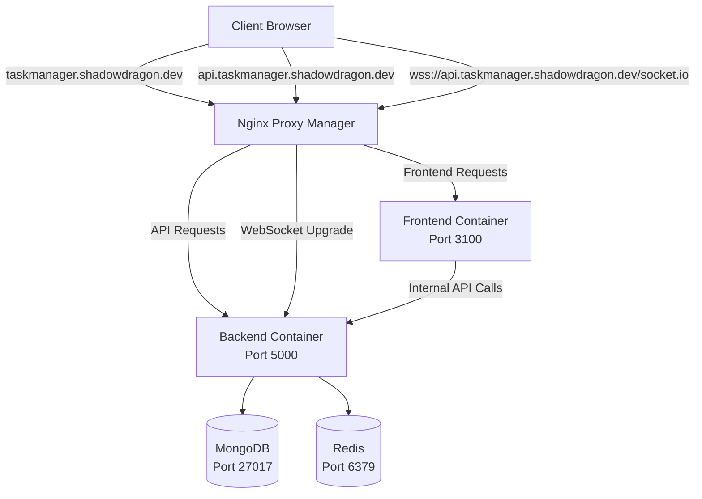

# Design Document

## Overview

The task manager application is experiencing critical infrastructure issues that prevent core functionality from working. The primary problems are:

1. **API Routing Misconfiguration**: The 2-host setup with Nginx Proxy Manager is not correctly routing API requests to the backend service
2. **WebSocket Connection Failures**: Real-time features are failing due to improper WebSocket routing and configuration
3. **Environment Configuration Issues**: Inconsistent environment variables across services causing connection failures
4. **Health Check Problems**: The health endpoint is not accessible through the proxy, making debugging difficult

This design addresses these issues through systematic infrastructure fixes, proper proxy configuration, and environment standardization.

## Architecture

### Current Architecture Issues

Based on the analysis of the codebase and terminal output:

- **Backend Service**: Runs on port 5000, exposes `/health` and `/api/*` endpoints
- **Frontend Service**: Next.js app on port 3000 (mapped to 3100), handles authentication and UI
- **Proxy Configuration**: Nginx Proxy Manager should route:
  - `taskmanager.shadowdragon.dev` → Frontend (port 3100)
  - `api.taskmanager.shadowdragon.dev` → Backend (port 5000)

### Root Cause Analysis

1. **API Routing Problem**: The test shows that `https://taskmanager.shadowdragon.dev/api/health` returns a Next.js 404 page instead of being routed to the backend
2. **Socket Connection Issues**: WebSocket connections to `wss://taskmanager.shadowdragon.dev/socket.io/` are failing because they're not being routed to the backend
3. **Environment Inconsistencies**: The `.env.production` file is truncated and missing critical configuration

### Target Architecture



## Components and Interfaces

### 1. Nginx Proxy Manager Configuration

**Frontend Proxy Host**:
- Domain: `taskmanager.shadowdragon.dev`
- Forward to: `localhost:3100`
- WebSocket Support: Enabled (for Next.js hot reload)
- SSL: Let's Encrypt

**Backend API Proxy Host**:
- Domain: `api.taskmanager.shadowdragon.dev`
- Forward to: `localhost:5000`
- WebSocket Support: Enabled (critical for Socket.io)
- SSL: Let's Encrypt
- Custom headers for WebSocket upgrade

### 2. Environment Configuration Standardization

**Required Environment Variables**:
```bash
# Database Configuration
MONGODB_URI=
REDIS_URL=

# Authentication
JWT_SECRET=
NEXTAUTH_SECRET=
NEXTAUTH_URL=https://taskmanager.shadowdragon.dev

# API URLs
NEXT_PUBLIC_API_URL=https://api.taskmanager.shadowdragon.dev
INTERNAL_API_URL=http://taskmanager-backend:5000
FRONTEND_URL=https://taskmanager.shadowdragon.dev

# OAuth
GITHUB_CLIENT_ID=
GITHUB_CLIENT_SECRET=
GOOGLE_CLIENT_ID=
GOOGLE_CLIENT_SECRET=
```

### 3. Backend API Health Check Enhancement

**Current Issue**: The `/health` endpoint returns "Unauthorized" when accessed directly
**Solution**: Modify the health check to be publicly accessible and provide detailed service status

### 4. Socket.io Configuration Fix

**Current Issue**: Frontend tries to connect to `https://taskmanager.shadowdragon.dev` for Socket.io
**Solution**: Update frontend to connect to `https://api.taskmanager.shadowdragon.dev` for WebSocket connections

## Data Models

### Health Check Response Model
```typescript
interface HealthCheckResponse {
  status: 'OK' | 'ERROR';
  timestamp: string;
  uptime: number;
  services: {
    database: 'connected' | 'disconnected';
    redis: 'connected' | 'disconnected';
    socketio: 'active' | 'inactive';
  };
  version: string;
}
```

### Environment Configuration Model
```typescript
interface EnvironmentConfig {
  // Database
  MONGODB_URI: string;
  REDIS_URL: string;
  
  // Authentication
  JWT_SECRET: string;
  NEXTAUTH_SECRET: string;
  NEXTAUTH_URL: string;
  
  // API URLs
  NEXT_PUBLIC_API_URL: string;
  INTERNAL_API_URL: string;
  FRONTEND_URL: string;
  
  // OAuth
  GITHUB_CLIENT_ID: string;
  GITHUB_CLIENT_SECRET: string;
  GOOGLE_CLIENT_ID: string;
  GOOGLE_CLIENT_SECRET: string;
}
```

## Error Handling

### 1. API Routing Errors
- **404 Errors**: Implement proper error responses that distinguish between frontend and backend 404s
- **Proxy Errors**: Add custom error pages for proxy failures
- **Timeout Handling**: Configure appropriate timeouts for API requests

### 2. WebSocket Connection Errors
- **Connection Failures**: Implement exponential backoff retry logic
- **Authentication Errors**: Provide clear error messages for auth failures
- **Fallback Mechanisms**: Implement polling fallback when WebSocket fails

### 3. Environment Configuration Errors
- **Missing Variables**: Fail fast with clear error messages
- **Invalid Values**: Validate environment variables on startup
- **Connection Failures**: Provide detailed error information for database/Redis connection issues

## Testing Strategy

### 1. Infrastructure Testing
- **Health Check Validation**: Verify `/health` endpoint returns proper JSON response
- **API Routing Tests**: Confirm all API endpoints are accessible through proxy
- **WebSocket Connection Tests**: Validate Socket.io connections work through proxy

### 2. Environment Configuration Testing
- **Variable Validation**: Test that all required environment variables are present
- **Service Connectivity**: Verify connections to MongoDB and Redis
- **Cross-Service Communication**: Test internal API calls between frontend and backend

### 3. End-to-End Testing
- **User Signup Flow**: Test complete signup process through proxy
- **Real-time Features**: Verify WebSocket functionality works end-to-end
- **Authentication Flow**: Test OAuth and credential-based authentication

### 4. Monitoring and Diagnostics
- **Health Check Monitoring**: Implement automated health check monitoring
- **Connection Status Tracking**: Monitor WebSocket connection health
- **Error Logging**: Comprehensive error logging for debugging

## Implementation Approach

### Phase 1: Environment Configuration Fix
1. Complete the `.env.production` file with all required variables
2. Ensure consistency across all environment files
3. Validate environment variables on application startup

### Phase 2: Backend Health Check Enhancement
1. Modify the `/health` endpoint to be publicly accessible
2. Add service status checks for MongoDB, Redis, and Socket.io
3. Implement detailed health reporting

### Phase 3: Proxy Configuration
1. Configure Nginx Proxy Manager with correct routing rules
2. Enable WebSocket support for the API proxy host
3. Test API routing and WebSocket connections

### Phase 4: Frontend Socket Configuration
1. Update Socket.io connection URL to use API subdomain
2. Implement proper error handling and retry logic
3. Test real-time features end-to-end

### Phase 5: Validation and Testing
1. Run comprehensive tests on all fixed components
2. Validate signup flow works correctly
3. Confirm real-time features are functional