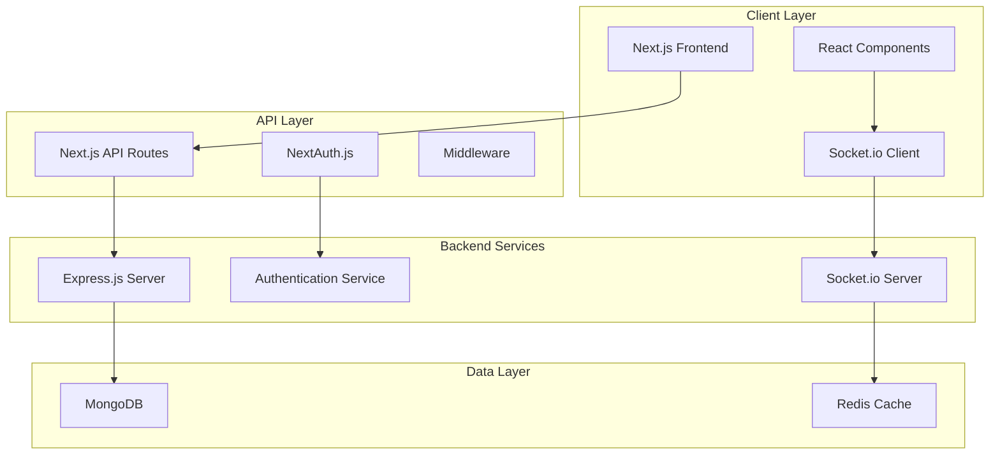

# Design Document

## Overview

The Real-Time Collaborative Task Manager is architected as a modern full-stack application using the MERN stack with Next.js. The system follows a microservices-inspired approach with clear separation between the Next.js frontend/API layer and the Express.js backend services. Real-time functionality is achieved through WebSocket connections, while data persistence uses MongoDB with optimized schemas and indexing.

## Architecture

### High-Level Architecture



### Technology Stack

**Frontend:**
- Next.js 14+ with App Router for SSR/SSG
- React 18+ with hooks and Context API
- TypeScript for type safety
- TailwindCSS for styling
- React Query (TanStack Query) for data fetching
- React Beautiful DnD for drag-and-drop
- Socket.io-client for real-time updates

**Backend:**
- Express.js with TypeScript
- Socket.i auo for WebSocket management
- NextAuth.js forthentication
- Mongoose for MongoDB ODM
- Redis for session storage and caching
- JWT for token management

**Database:**
- MongoDB for primary data storage
- Redis for caching and session management

**DevOps:**
- Docker for containerization
- GitHub Actions for CI/CD
- Vercel for frontend deployment
- VPS with nginx reverse proxy and Portainer for backend deployment
- SonarQube for code quality

## Components and Interfaces

### Frontend Components

#### Core Layout Components
- `Layout`: Main application wrapper with navigation
- `Sidebar`: Project navigation and user menu
- `Header`: Top navigation with user profile and notifications
- `AuthGuard`: HOC for route protection

#### Task Management Components
- `ProjectBoard`: Main Kanban board container
- `TaskColumn`: Individual status columns (To Do, In Progress, Done)
- `TaskCard`: Individual task display with drag functionality
- `TaskModal`: Task creation/editing modal
- `ProjectSelector`: Project switching interface

#### Authentication Components
- `LoginForm`: Email/password authentication
- `SignupForm`: User registration
- `OAuthButtons`: Social login options
- `ProtectedRoute`: Route wrapper for authenticated pages

### Backend API Interfaces

#### REST API Endpoints

```typescript
// Projects API
GET    /api/projects          // List user projects
POST   /api/projects          // Create new project
GET    /api/projects/:id      // Get project details
PUT    /api/projects/:id      // Update project
DELETE /api/projects/:id      // Delete project

// Tasks API
GET    /api/projects/:id/tasks     // List project tasks
POST   /api/projects/:id/tasks     // Create new task
PUT    /api/tasks/:id              // Update task
DELETE /api/tasks/:id              // Delete task

// Users API
GET    /api/users/profile     // Get user profile
PUT    /api/users/profile     // Update user profile
GET    /api/users/search      // Search users for assignment

// Authentication API
POST   /api/auth/signin       // User login
POST   /api/auth/signup       // User registration
POST   /api/auth/signout      // User logout
GET    /api/auth/session      // Get current session
```

#### WebSocket Events

```typescript
// Client to Server Events
interface ClientToServerEvents {
  joinProject: (projectId: string) => void;
  leaveProject: (projectId: string) => void;
  updateTask: (taskId: string, updates: Partial<Task>) => void;
  moveTask: (taskId: string, newStatus: TaskStatus, newPosition: number) => void;
}

// Server to Client Events
interface ServerToClientEvents {
  taskUpdated: (task: Task) => void;
  taskMoved: (taskId: string, newStatus: TaskStatus, newPosition: number) => void;
  userJoined: (user: User, projectId: string) => void;
  userLeft: (userId: string, projectId: string) => void;
}
```

## Data Models

### MongoDB Schemas

#### User Schema
```typescript
interface User {
  _id: ObjectId;
  email: string;
  password: string; // Hashed password for email/password auth
  name: string;
  avatar?: string;
  role: 'admin' | 'user';
  createdAt: Date;
  updatedAt: Date;
}
```

#### Project Schema
```typescript
interface Project {
  _id: ObjectId;
  name: string;
  description?: string;
  owner: ObjectId; // User reference
  members: ObjectId[]; // User references
  createdAt: Date;
  updatedAt: Date;
}
```

#### Task Schema
```typescript
interface Task {
  _id: ObjectId;
  title: string;
  description?: string;
  status: 'todo' | 'inprogress' | 'done';
  priority: 'low' | 'medium' | 'high';
  assignee?: ObjectId; // User reference
  project: ObjectId; // Project reference
  position: number; // For ordering within status
  dueDate?: Date;
  createdBy: ObjectId; // User reference
  createdAt: Date;
  updatedAt: Date;
}
```

#### ActivityLog Schema
```typescript
interface ActivityLog {
  _id: ObjectId;
  action: 'created' | 'updated' | 'deleted' | 'moved';
  entityType: 'task' | 'project';
  entityId: ObjectId;
  user: ObjectId; // User reference
  project: ObjectId; // Project reference
  changes?: Record<string, any>;
  timestamp: Date;
}
```

### Database Indexing Strategy

```javascript
// Users Collection
db.users.createIndex({ email: 1 }, { unique: true });

// Projects Collection
db.projects.createIndex({ owner: 1 });
db.projects.createIndex({ members: 1 });

// Tasks Collection
db.tasks.createIndex({ project: 1, status: 1 });
db.tasks.createIndex({ assignee: 1 });
db.tasks.createIndex({ project: 1, position: 1 });

// ActivityLogs Collection
db.activitylogs.createIndex({ project: 1, timestamp: -1 });
db.activitylogs.createIndex({ user: 1, timestamp: -1 });
```

## Error Handling

### Frontend Error Handling
- React Error Boundaries for component-level error catching
- React Query error handling for API failures
- Toast notifications for user-friendly error messages
- Fallback UI components for graceful degradation
- Socket.io reconnection logic for network issues

### Backend Error Handling
- Global Express error middleware
- Mongoose validation error handling
- JWT token validation and refresh logic
- Socket.io connection error management
- Database connection retry mechanisms

### Error Response Format
```typescript
interface ErrorResponse {
  success: false;
  error: {
    code: string;
    message: string;
    details?: any;
  };
  timestamp: string;
}
```

## Testing Strategy

### Frontend Testing
- **Unit Tests**: Jest + React Testing Library for components
- **Integration Tests**: Testing user interactions and API integration
- **E2E Tests**: Playwright for critical user journeys
- **Visual Regression**: Chromatic for UI consistency

### Backend Testing
- **Unit Tests**: Jest for service functions and utilities
- **Integration Tests**: Supertest for API endpoint testing
- **Database Tests**: MongoDB Memory Server for isolated testing
- **Socket.io Tests**: Custom test utilities for real-time functionality

### Test Coverage Goals
- Minimum 80% code coverage for critical paths
- 100% coverage for authentication and authorization logic
- Integration tests for all API endpoints
- E2E tests for core user workflows

### Continuous Integration
- Automated test execution on pull requests
- Code quality gates with SonarQube
- Performance testing with Lighthouse CI
- Security scanning with Snyk

## Security Considerations

### Authentication & Authorization
- JWT tokens with short expiration and refresh mechanism
- Role-based access control (RBAC) implementation
- NextAuth.js secure session management
- OAuth integration with proper scope validation

### Data Protection
- Input validation and sanitization
- MongoDB injection prevention
- XSS protection with Content Security Policy
- CORS configuration for API security

### Real-time Security
- Socket.io authentication middleware
- Room-based access control for projects
- Rate limiting for WebSocket events
- Connection validation and cleanup

## Performance Optimizations

### Frontend Optimizations
- Next.js static generation for landing pages
- Server-side rendering for authenticated pages
- React Query caching and background updates
- Code splitting and lazy loading
- Image optimization with Next.js Image component

### Backend Optimizations
- MongoDB connection pooling
- Redis caching for frequently accessed data
- Database query optimization with proper indexing
- Socket.io room management for efficient broadcasting
- API response compression

### Deployment Optimizations
- Docker multi-stage builds for smaller images
- nginx reverse proxy configuration for backend routing
- Portainer container management for easy deployment
- CDN integration for static assets
- Database connection optimization
- Health check endpoints for monitoring