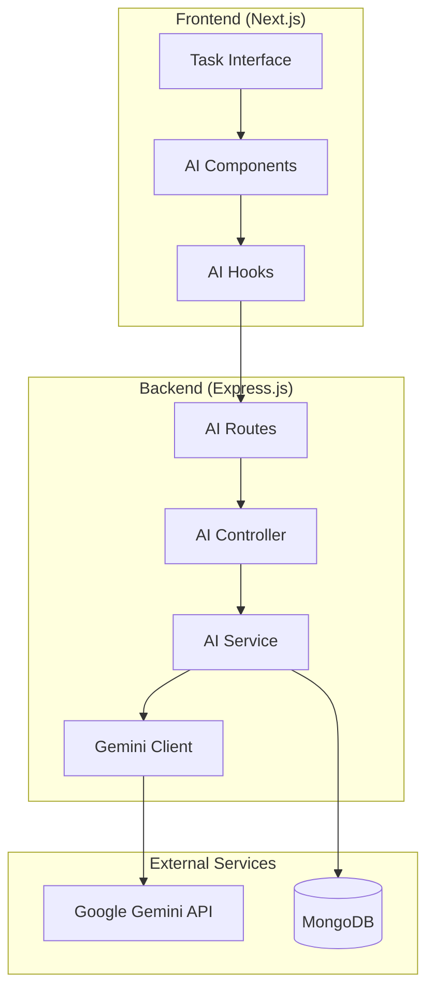

# Design Document: Gemini AI Integration

## Overview

This design implements AI-powered features using Google's Gemini API to enhance the collaborative task management system. The solution adds intelligent task summarization and question-answering capabilities while maintaining the existing architecture patterns and security standards.

## Architecture

### High-Level Architecture



### Service Layer Integration

The AI functionality integrates into the existing service architecture:

- **AI Service**: New service layer component handling Gemini API interactions
- **AI Controller**: REST API endpoints for AI operations
- **AI Routes**: Express routes following existing patterns
- **Frontend Components**: React components integrated into existing task interface

## Components and Interfaces

### Backend Components

#### 1. AI Service (`src/services/aiService.ts`)

```typescript
interface AIService {
  generateProjectSummary(projectId: string, userId: string): Promise<ProjectSummary>
  answerTaskQuestion(taskId: string, question: string, userId: string): Promise<AIResponse>
  validateApiKey(): Promise<boolean>
  checkQuotaStatus(): Promise<QuotaStatus>
}

interface ProjectSummary {
  projectId: string
  summary: string
  taskCount: number
  statusBreakdown: Record<string, number>
  generatedAt: Date
  userId: string
}

interface AIResponse {
  taskId: string
  question: string
  answer: string
  confidence: number
  generatedAt: Date
  userId: string
}
```

#### 2. Gemini Client (`src/services/geminiClient.ts`)

```typescript
interface GeminiClient {
  generateContent(prompt: string, context?: any): Promise<string>
  validateConnection(): Promise<boolean>
  getUsageStats(): Promise<UsageStats>
}

interface UsageStats {
  requestsToday: number
  quotaLimit: number
  quotaRemaining: number
}
```

#### 3. AI Controller (`src/controllers/aiController.ts`)

```typescript
interface AIController {
  generateProjectSummary(req: Request, res: Response): Promise<void>
  answerTaskQuestion(req: Request, res: Response): Promise<void>
  getAIStatus(req: Request, res: Response): Promise<void>
}
```

### Frontend Components

#### 1. AI Summary Component

```typescript
interface ProjectSummaryProps {
  projectId: string
  onSummaryGenerated?: (summary: ProjectSummary) => void
}

interface ProjectSummaryState {
  summary: ProjectSummary | null
  isLoading: boolean
  error: string | null
}
```

#### 2. AI Question Component

```typescript
interface TaskAIQuestionProps {
  task: Task
  onQuestionAnswered?: (response: AIResponse) => void
}

interface TaskAIQuestionState {
  question: string
  response: AIResponse | null
  isLoading: boolean
  error: string | null
  conversationHistory: AIResponse[]
}
```

### API Endpoints

#### Project Summary
- **POST** `/api/ai/projects/:id/summary`
- **GET** `/api/ai/projects/:id/summary/latest`

#### Task Questions
- **POST** `/api/ai/tasks/:id/question`
- **GET** `/api/ai/tasks/:id/questions/history`

#### AI Status
- **GET** `/api/ai/status`

## Data Models

### AI Summary Model

```typescript
interface AISummary {
  _id: string
  projectId: string
  userId: string
  summary: string
  taskCount: number
  statusBreakdown: {
    todo: number
    inprogress: number
    done: number
  }
  generatedAt: Date
  expiresAt: Date
}
```

### AI Question Model

```typescript
interface AIQuestion {
  _id: string
  taskId: string
  userId: string
  question: string
  answer: string
  confidence: number
  context: {
    taskTitle: string
    taskDescription: string
    projectName: string
  }
  createdAt: Date
}
```

## Error Handling

### Error Types

1. **API Connection Errors**
   - Gemini API unavailable
   - Network timeouts
   - Authentication failures

2. **Quota Errors**
   - Daily quota exceeded
   - Rate limit exceeded
   - Billing issues

3. **Validation Errors**
   - Invalid project/task IDs
   - Unauthorized access
   - Malformed requests

### Error Response Format

```typescript
interface AIErrorResponse {
  success: false
  error: {
    code: 'AI_SERVICE_UNAVAILABLE' | 'QUOTA_EXCEEDED' | 'INVALID_REQUEST' | 'UNAUTHORIZED'
    message: string
    details?: {
      quotaRemaining?: number
      retryAfter?: number
    }
  }
  timestamp: string
}
```

### Fallback Strategies

1. **Service Degradation**: Disable AI features gracefully when API is unavailable
2. **Caching**: Cache recent summaries to reduce API calls
3. **Queue Management**: Queue requests during high load periods
4. **User Notification**: Clear messaging about AI service status

## Testing Strategy

### Unit Tests

1. **AI Service Tests**
   - Gemini API integration
   - Response parsing and validation
   - Error handling scenarios
   - Quota management

2. **Controller Tests**
   - Request validation
   - Authentication checks
   - Response formatting
   - Error responses

3. **Frontend Component Tests**
   - UI interaction flows
   - Loading states
   - Error display
   - Response rendering

### Integration Tests

1. **API Integration**
   - End-to-end AI request flows
   - Authentication integration
   - Database operations
   - Error propagation

2. **Frontend Integration**
   - Component interaction with hooks
   - State management
   - Error boundary behavior
   - User experience flows

### Mock Strategy

- Mock Gemini API responses for consistent testing
- Test both success and failure scenarios
- Validate rate limiting behavior
- Test quota exhaustion handling

## Security Considerations

### API Key Management

- Store Gemini API key in environment variables
- Validate key format and permissions on startup
- Rotate keys through configuration updates
- Monitor for unauthorized usage

### Data Privacy

- Sanitize task data before sending to Gemini API
- Remove sensitive information from prompts
- Log AI interactions for audit purposes
- Implement data retention policies

### Access Control

- Verify user permissions for project/task access
- Validate project membership before AI operations
- Implement rate limiting per user
- Monitor for abuse patterns

## Performance Considerations

### Caching Strategy

- Cache project summaries for 1 hour
- Cache frequently asked questions
- Implement Redis-based caching
- Invalidate cache on task updates

### Rate Limiting

- Implement per-user rate limits (10 requests/minute)
- Global rate limiting for API quota management
- Queue requests during peak usage
- Provide user feedback on limits

### Optimization

- Batch multiple task contexts for efficiency
- Compress prompts to reduce token usage
- Implement request deduplication
- Monitor and optimize response times

## Configuration

### Environment Variables

```bash
# Gemini API Configuration
GEMINI_API_KEY=your_api_key_here
GEMINI_MODEL=gemini-1.5-flash
GEMINI_MAX_TOKENS=1000
GEMINI_TEMPERATURE=0.7

# AI Service Configuration
AI_CACHE_TTL=3600
AI_RATE_LIMIT_PER_USER=10
AI_RATE_LIMIT_WINDOW=60000
AI_MAX_CONTEXT_LENGTH=4000

# Feature Flags
AI_FEATURES_ENABLED=true
AI_SUMMARY_ENABLED=true
AI_QUESTIONS_ENABLED=true
```

### Database Indexes

```javascript
// Optimize AI-related queries
db.aisummaries.createIndex({ projectId: 1, createdAt: -1 })
db.aisummaries.createIndex({ expiresAt: 1 }, { expireAfterSeconds: 0 })
db.aiquestions.createIndex({ taskId: 1, createdAt: -1 })
db.aiquestions.createIndex({ userId: 1, createdAt: -1 })
```

## Deployment Considerations

### Environment Setup

1. **Development**: Use test API keys with lower quotas
2. **Staging**: Mirror production configuration with separate keys
3. **Production**: Full quota allocation with monitoring

### Monitoring

- Track API usage and costs
- Monitor response times and error rates
- Alert on quota thresholds
- Log user interaction patterns

### Rollback Strategy

- Feature flags for quick disable
- Database migration rollback scripts
- API key rotation procedures
- User communication plan